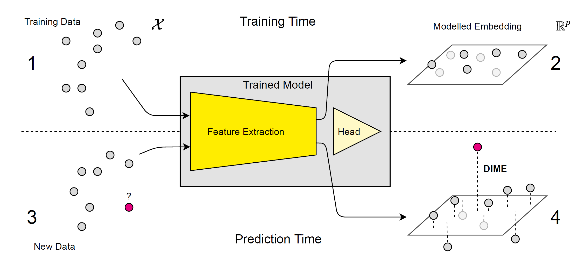

# Distance to Modelled Embedding (DIME)

This repo contains an implementation of DIME, which is a method to detect out-of-distribution (OOD) observations in deep 
learning. DIME provides a flexible method to detect OOD-observations with minimal computational overhead and simply assumes
access to intermediate features from an ANN.



The workflow how DIME works is summarized in four steps.

1. Given a trained ANN and training set observations, obtain intermediate feature representations of the
   training set observations (here denoted embedding). If the embeddings are higher than 2-dimensional, 
   aggregate to a 2D-matrix NxP-matrix (for instance by global average pooling in the context of 
   NxCxHxW-representations from a CNN).
3. Linearly approximate the training set embedding by a hyperplane found by truncated singular value decomposition.
4. Given new observations, obtain the corresponding intermediate representation.
5. In the embedding space, measure the distance to the hyperplane (modelled embedding) to determine whether 
   observations are OOD.

In an optional step following 2., you can calibrate the distances against a calibration set to obtain probabilities of 
observing an observation with less than or equal distance to the observed distance.

## Get started
Simply install from pip:
```
pip install dime-pytorch
```

## Examples
Given a 2D-tensor, fit the hyperplane.

    from dime import DIME

    x = torch.tensor(...) # N x P torch 2D float-tensor.
    modelled_embedding = DIME().fit(x)

To obtain probabilities, calibrate percentiles. Preferably against
separate dataset. Chaining is fine.:


    x_cal = torch.tensor(...)  # N_cal x P torch 2D float-tensor.
    modelled_embedding = DIME().fit(x).calibrate(x_cal)

Given fitted hyperplane, you can calculate distances on new observations:

    x_new = torch.tensor(...)  # N_new x P 2D float-tensor.
    modelled_embedding.distance_to_hyperplane(x_new)  # -> 1D float-tensor, length N_new

To obtain probabilities of that the new observations have a distance
calibration set observations are equal or less than the new distance, 
you need to have calibrated the percentiles as shown above. Then you
receive the probablities by passing `return_probablities`-keyword:

    modelled_embedding.distance_to_hyperplane(x_new, return_probabilites=True) # -> 1D float-tensor, length N_new

You can also use the alternative formulation of distance within the hyperplane, optionally as probabilities:

    modelled_embedding.distance_within_hyperplane(x_new)  # -> 1D float-tensor, length N_new

## License

Distributed under the MIT-license. See LICENSE for more information.

© 2021 Sartorius AG